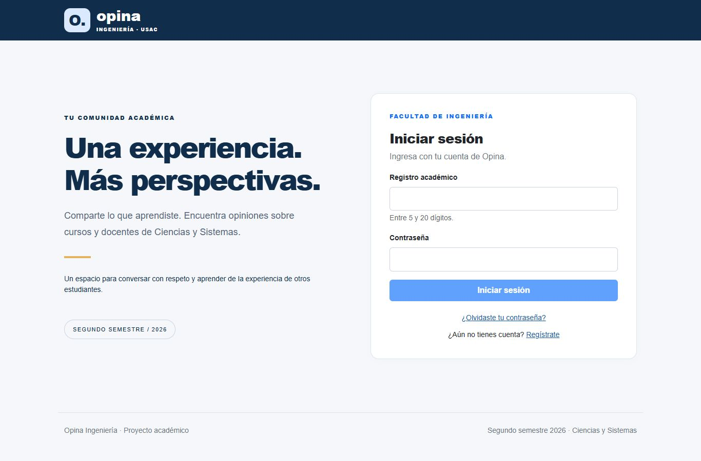
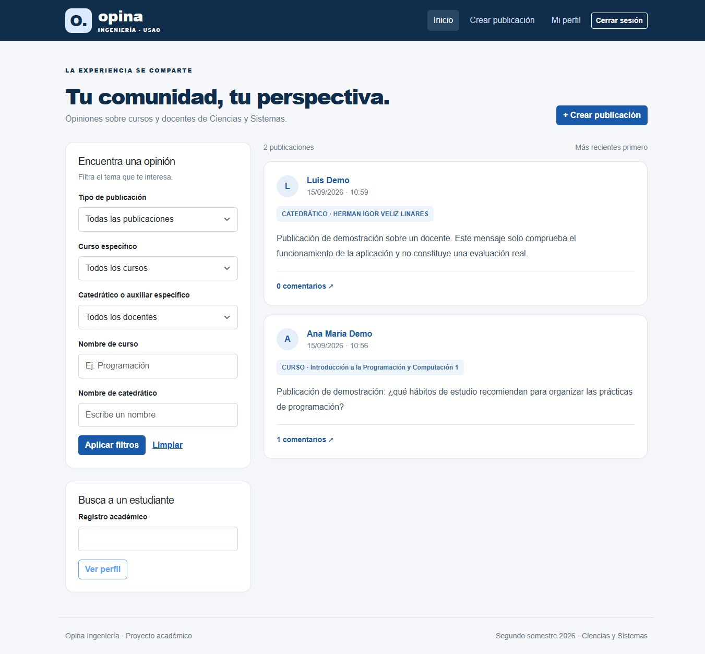
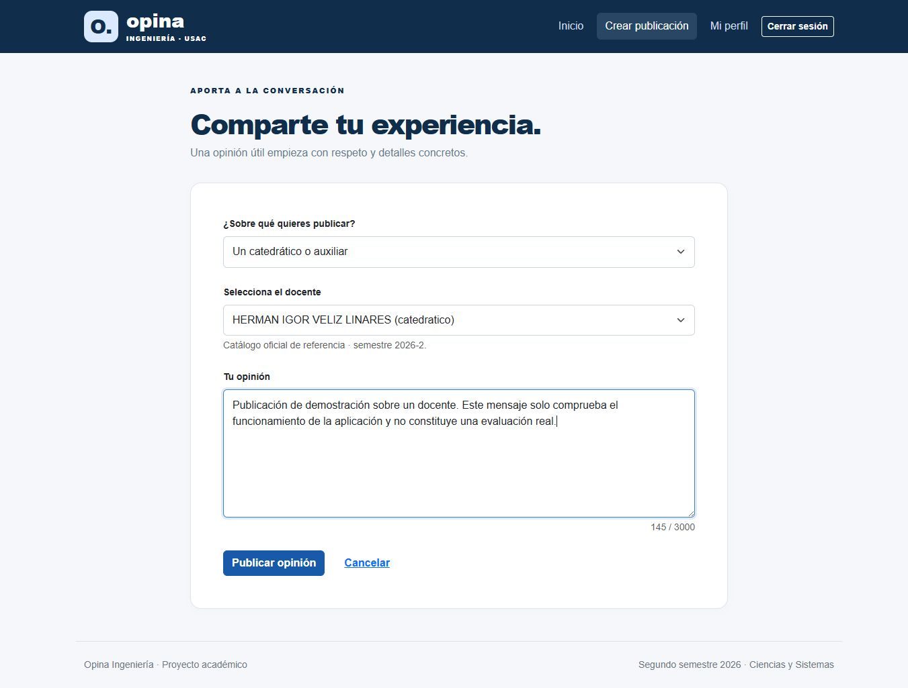
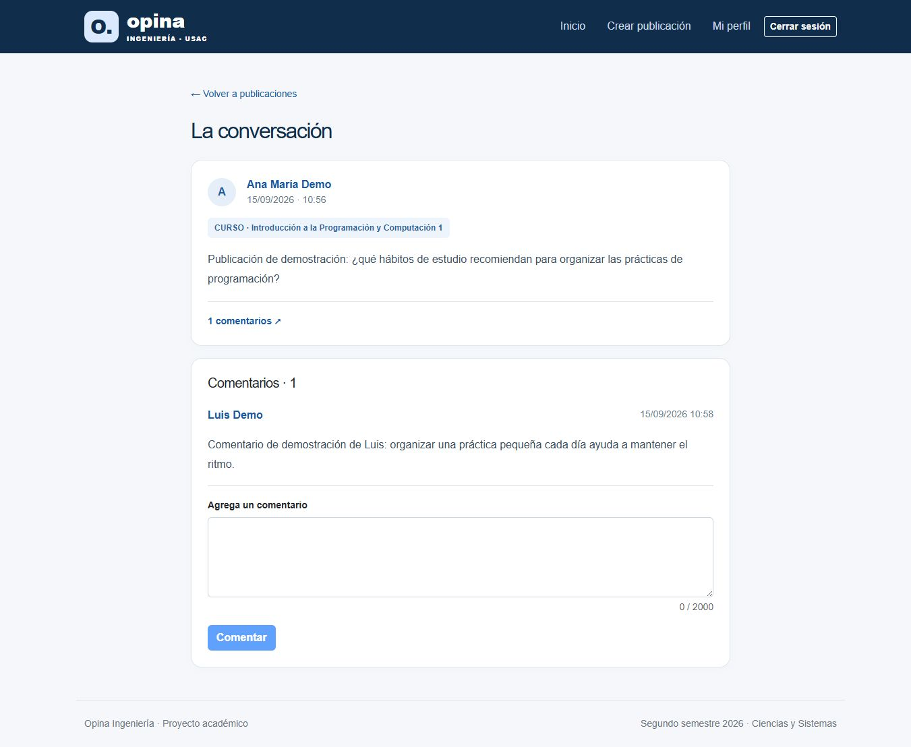
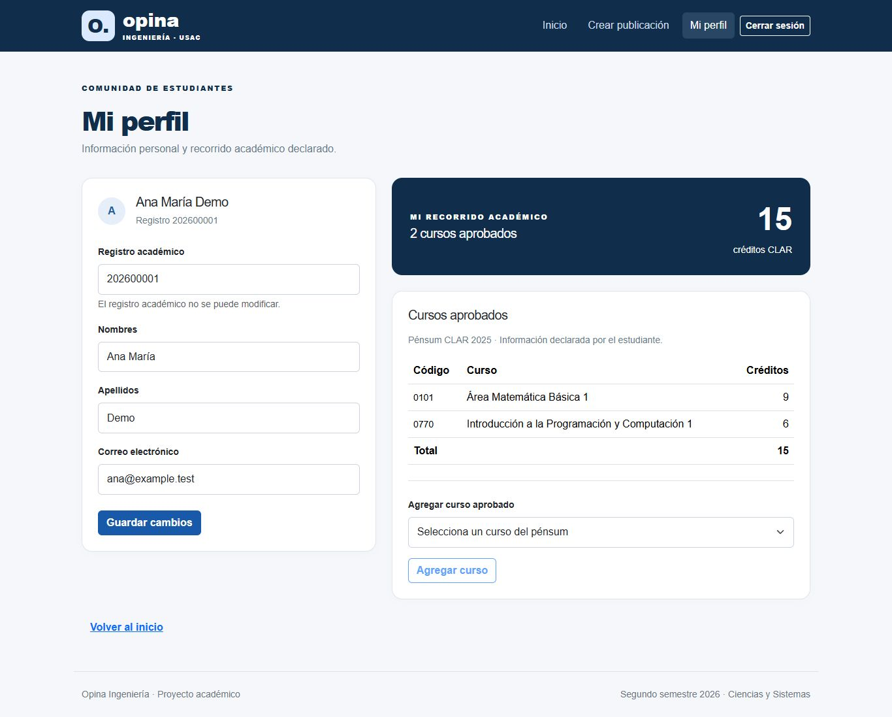

# Manual de usuario

## 1. Acceder

Abrir http://127.0.0.1:4200 con los servidores iniciados (o puerto 3000 en modo compilado). Utilizar una cuenta propia de Opina, no la contraseña institucional.

## 2. Registro

Pulsar **Regístrate**, completar registro académico, nombres, apellidos, correo y contraseña, y pulsar **Crear cuenta**. El sistema redirige al inicio de sesión.

El registro acepta 5-20 dígitos. Nombres y apellidos aceptan hasta 80 caracteres. La contraseña requiere mínimo 8 caracteres y máximo 72 bytes; letras acentuadas pueden ocupar más de un byte. El correo debe tener formato válido. No se pueden repetir registro ni correo.

## 3. Inicio y cierre de sesión

Ingresar registro y contraseña. Si no coinciden, se muestra «Registro o contraseña incorrectos». La sesión dura ocho horas y se conserva al recargar. **Cerrar sesión** la invalida en el servidor. Para verificar interacciones usar las dos cuentas demo del README.

## 4. Recuperar contraseña

En **¿Olvidaste tu contraseña?**, escribir registro, correo registrado y nueva contraseña. Si coinciden, se cambia la contraseña y se invalidan sesiones anteriores. Si no, se muestra «El registro académico y el correo no coinciden». Volver al inicio de sesión.

Este es el flujo académico solicitado. Antes de uso público necesita verificación adicional de identidad.

## 5. Publicaciones y filtros

Las tarjetas muestran autor, fecha, tema, mensaje y acceso a comentarios, ordenadas de la más reciente a la más antigua. Pulsar el nombre del autor abre su perfil.

- **Por curso:** seleccionar ese tipo en Tipo de publicación.
- **Por catedrático / auxiliar:** seleccionar ese tipo.
- **Nombre de curso:** escribir todo o parte del nombre.
- **Nombre de catedrático:** escribir todo o parte del nombre.

También se puede elegir un curso/docente específico. Pulsar **Aplicar filtros**. Los criterios se combinan; elegir curso y docente simultáneamente puede dar cero resultados porque cada publicación tiene un solo destino. **Limpiar** restablece todo.

Se muestran estados de carga, ausencia de resultados y errores de conexión. **Reintentar** vuelve a consultar al servidor.

## 6. Crear publicación

1. Pulsar **Crear publicación**.
2. Elegir curso o catedrático/auxiliar.
3. Seleccionar una entidad del catálogo del segundo semestre 2026.
4. Escribir el mensaje, hasta 3000 caracteres.
5. Pulsar **Publicar opinión**. El sistema regresa al listado actualizado.

El autor y la fecha se obtienen en el servidor. No se pueden alterar desde el formulario. Mantener el respeto y aportar contexto concreto.

## 7. Comentarios

Abrir el número de comentarios de una tarjeta. Escribir hasta 2000 caracteres y pulsar **Comentar**. El comentario muestra autor y fecha y persiste después de recargar. Una segunda cuenta puede responder a publicaciones de la primera.

## 8. Perfiles

En el inicio, escribir el registro en **Busca a un estudiante** y pulsar **Ver perfil**. Si no existe aparece un error. El perfil muestra datos personales, cursos y créditos; nunca muestra contraseñas.

**Mi perfil** permite editar nombres, apellidos y correo con **Guardar cambios**. El registro es de solo lectura. Los perfiles ajenos no muestran controles para modificar sus datos.

## 9. Cursos aprobados

En el perfil propio seleccionar un curso del pénsum y pulsar **Agregar curso**. La lista y créditos se actualizan. Los cursos ya agregados no aparecen en la selección y la base también impide duplicados.

El total usa los créditos CLAR del catálogo. El historial es declarado por el usuario; no certifica aprobaciones institucionales ni valida prerrequisitos. Otros perfiles permiten consultarlo sin modificarlo.

## 10. Teléfono y errores

La navegación y formularios se adaptan al ancho disponible. En teléfono los filtros aparecen antes del listado; desplazarse hacia abajo para ver opiniones. Si aparece un error de conexión, comprobar que Express y MySQL estén iniciados. Si la sesión expira, volver a iniciar sesión.

Las capturas se obtuvieron de la aplicación el 15/09/2026. Los datos de demostración no representan evaluaciones reales de docentes.

## Catálogos actualizados el 16/09/2026

Las publicaciones usan 34 cursos y 169 asignaciones de DTT, segundo semestre de 2026. Los practicantes finales se representan con rol auxiliar. Los profesores no publicados se dejan ausentes. Los cursos aprobados usan los 75 cursos del pénsum CLAR 2025 y sus créditos verificados. No se equiparan automáticamente materias de planes distintos.
